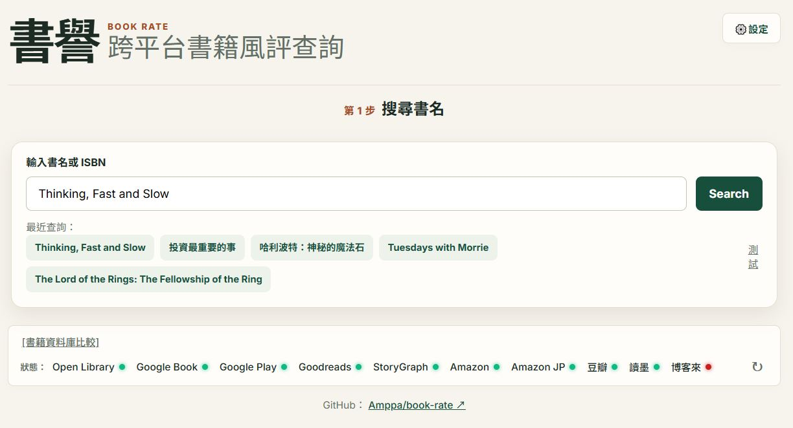
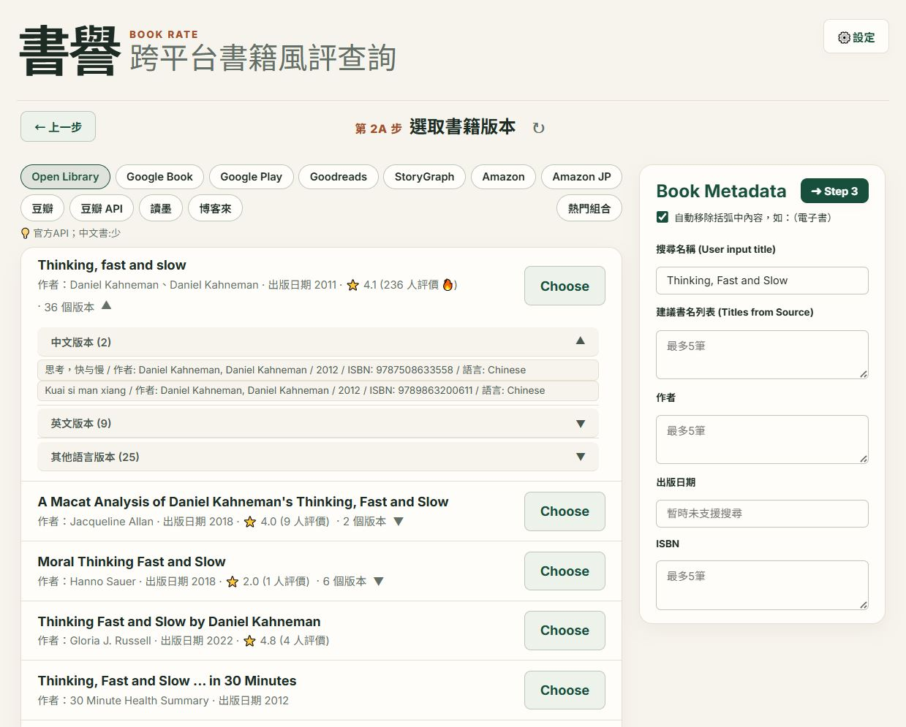
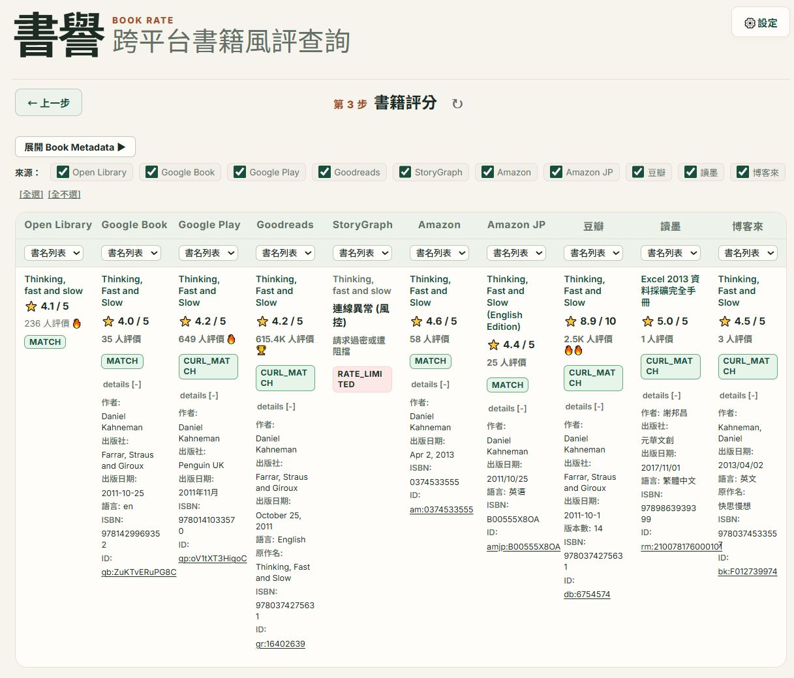

# BookRate 📚

跨平台圖書評分聚合工具。輸入書名、作者或 ISBN，即可一鍵整合全球 10+ 個主流圖書平台的讀者評分、評價人數與出版資訊。

---

## 核心功能

- **3 步驟導引流程**：
  1. **搜尋書名**：輸入書名、作者或 ISBN 搜尋目標書籍。
     <br>
     <a href="docs/images/step1.JPG" target="_blank" rel="noopener noreferrer"></a>
  2. **確認書籍資訊**：自動整理候選版本與書名別名，亦可手動調整搜尋關鍵字。
     <br>
     <a href="docs/images/step2.JPG" target="_blank" rel="noopener noreferrer"></a>
  3. **評分比較**：以並排表格呈現各平台評分、評價人數與原始頁面連結。
     <br>
     <a href="docs/images/step3.JPG" target="_blank" rel="noopener noreferrer"></a>
- **快速模式 (Quick Mode)**：搜尋後直接進入評分比較，略過中間確認步驟。
- **即時串流呈現**：多平台同時發送查詢，個別平台回傳結果即時顯示，無需等待全部載入完成。
- **書籍詳細資料**：各平台比對結果均可展開檢視作者、譯者、出版社、出版日期及 ISBN 等資訊。
- **出版版本清單**：支援 Open Library、Goodreads、豆瓣與 StoryGraph 展開多版本列表。
- **本機快取機制**：查詢結果自動暫存於瀏覽器，提升重複查詢時的載入速度。

---

## 支援平台

涵蓋繁中、簡中、歐美與日本的主要購書與書評社群：

| 平台名稱 | 涵蓋地區 / 特色說明 |
| :--- | :--- |
| **博客來 (Books.com.tw)** | 台灣代表性網路書店，繁體中文書目完整 |
| **讀墨 (Readmoo)** | 台灣主要繁體中文電子書平台 |
| **豆瓣讀書** | 華文圈主流書評社群，評論深度與讀者數量豐富 |
| **豆瓣 API** | 豆瓣官方搜尋接口，提供快速檢索 |
| **Goodreads** | 全球最大歐美書評社群（Amazon 旗下），外文書評分首選 |
| **The StoryGraph** | 知名歐美獨立書評社群 |
| **Google Books** | Google 圖書資料庫，收錄海量圖書資訊 |
| **Google Play Books** | Google Play 電子書商店讀者評分 |
| **Amazon 美國站** | 全球最大電商平台，讀者評價基數龐大 |
| **Amazon 日本站** | 日本亞馬遜，日文書與輕小說評分首選 |
| **Open Library** | 非營利開放式圖書資料庫，擁有龐大跨國版本資料 |

---

## 安裝與執行

環境需求：**Python 3.9+**

### 1. 下載儲存庫
```bash
git clone https://github.com/Amppa/book-rate.git
cd book-rate
```

### 2. 安裝依賴套件
```bash
pip install -r requirements.txt
```

### 3. 啟動伺服器
```bash
python server.py
```

### 4. 開啟應用程式
使用瀏覽器造訪 [http://127.0.0.1:8000](http://127.0.0.1:8000) 即可開始使用。

> **💡 選用設定（Google Books API Key）**：  
> Google Books 官方提供的公開查詢額度較有限。若需提高查詢穩定性，可於網頁右上角「設定」中填入個人的 Google Books API Key（可於 Google Cloud Console 免費申請）。

---

## 授權條款

MIT License
